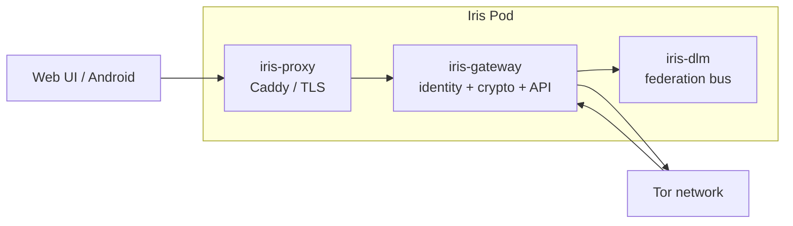

# Iris Messenger

**Iris — goddess of messages between worlds.**

> *“Then you would get more and more adventurous, and you would make further and further out gambles as to what you would dream, and finally you would dream where you are now.”*
>
> — Alan Watts

Imagine you could dream anything.

At first you would dream the obvious things: perfect places, impossible machines, people you miss, worlds that behave exactly as you tell them to.

Then, eventually, you would get bored.

You would start asking for surprises.

You would dream something you did not control. Then something you could not predict. Then something that could surprise you so completely that, for a moment, you would forget that you were the one dreaming it.

And eventually you would dream where you are now.

That idea sits strangely well with distributed systems.

We started with MazeMaker: a place to build things that could remember. Daedalus grew beside it: an agent that could carry a useful amount of its own history without dragging the entire universe through every request. And somewhere in the same mess, without anybody having written a product plan for it, Iris appeared.

A messenger.

Except there was no particular reason for it to need a central server.

So we removed the server.

Then there was no particular reason for the gateway to need a public IP.

So we put it behind Tor.

Then there was no particular reason the gateway should need a conventional installation.

So we put it in a single binary.

Then there was no particular reason that binary should belong to one machine.

So we made the whole thing portable.

At some point this stopped being a messaging application and became a rather elaborate argument with the network.

That is Iris.

---

## The short version

**Iris is private, end-to-end encrypted messaging without a central messaging service.**

There is no account system.

There is no central message database.

There is no company-operated server that needs to understand who is talking to whom.

Each Iris instance owns its own identity and cryptographic state. Messages are encrypted at the endpoint, transported as opaque ciphertext, queued when the other side is unavailable, and delivered when it returns.

The default federation transport is **Tor**.

Every Iris gateway can publish itself as a Tor v3 onion service. Tor is included in the single-file distribution, so there is nothing to configure and no separate Tor installation required.

Both sides make outbound connections.

No port forwarding.

No public IP exchange.

No CGNAT problem to solve.

No mysterious relay that needs to know what your message says.

The same protocol runs in the browser, on Android, and on a standalone Iris gateway.

And because apparently a private messenger needed to become a portable distributed system as well:

**the entire gateway fits in one binary and can carry its identity with the directory containing it.**

---

## A family of accidents

Iris did not arrive as the next item on a roadmap.

Neither did Daedalus.

They grew beside MazeMaker.

The projects share a particular architectural instinct:

> **Keep state close to the thing that owns it, and make the infrastructure between endpoints as stupid, disposable, and uninformed as possible.**

MazeMaker applies that idea to memory.

Daedalus applies it to LLM agents and context coffins.

Iris applies it to communication.

The result is not one framework. The projects are deliberately separate. They simply happen to have been born next to each other, solving different problems with the same suspicion of unnecessary infrastructure.

There is something slightly amusing about this in retrospect.

We did not set out to build an ecosystem.

We apparently set out to build three different escape routes from the same assumptions.

---

# What Iris is

Iris is an encrypted peer-to-peer messaging system built around **endpoint ownership**.

Each participant has an identity.

Each identity owns its private keys.

Each gateway owns its transport state.

Each conversation owns ratchet state.

Infrastructure transports encrypted envelopes without needing access to the plaintext.

The architecture has four important consequences:

1. **Identity belongs to the user, not the server.**
2. **Encryption happens before transport.**
3. **The network does not need to know the message contents.**
4. **A gateway can move without changing the identity it represents.**

The fourth one is easy to overlook.

With the portable distribution, an Iris installation looks roughly like this:

```text
iris-messenger/
├── iris-messenger        # the binary; Tor included
└── iris-data/            # created on first start
    ├── identity
    ├── keys
    ├── ratchets
    ├── peers
    ├── dlm/
    └── tor/
```

Copy the directory.

The identity goes with it.

There is no hidden identity database under `~/.iris`.

No cache that secretly becomes part of the installation.

No `/tmp` state required for normal operation.

The folder is the thing.

---

# Cryptography

Iris uses established cryptographic building blocks rather than inventing a proprietary messaging protocol.

The protocol combines:

* **X3DH** for asynchronous session establishment
* **Double Ratchet** for ongoing message encryption
* **AES-256-GCM** for authenticated encryption
* **ECDH P-256** identity and ephemeral key material
* signed prekeys
* one-time prekeys
* safety numbers
* sender keys for groups

The design follows the familiar family of protocols used by modern secure messengers, while implementing the surrounding gateway and federation architecture independently.

## Identity

Private identity keys never leave the device.

Only the public material required for pairing and session establishment is transmitted.

A peer therefore does not receive your private identity merely because it receives your public identity bundle.

The identity is also independent of the physical network address.

Your peer can disappear behind a different network, restart its gateway, change its carrier, or move from one machine to another without requiring the cryptographic identity to become a property of the network.

---

## X3DH pairing

Iris uses an X3DH-style bundle containing the material required to establish an encrypted session asynchronously.

A handshake URL looks approximately like this:

```text
iris://<gateway-id>#<identity-key>?spk=…&spksig=…&opk=…&label=Iris-<id>&gwkey=…&onion=<…>.onion
```

The URL can carry:

* gateway identity
* identity public key
* signed prekey
* signed prekey signature
* one-time prekey
* human-readable label
* pinned gateway key
* Tor onion address

The old LAN form is still accepted:

```text
iris://<gateway-id>#<public-key>
```

That keeps local and legacy federation paths usable without forcing every existing installation through the newer transport mechanism.

---

# Double Ratchet

Once a session has been established, messages move through a Double Ratchet state.

The point is not merely that messages are encrypted.

The important property is that the encryption state continuously evolves.

A compromised message key does not simply become a master key for everything that happened before and everything that will happen afterwards.

The ratchet state belongs to the endpoints.

The gateway does not need to understand it.

The federation layer does not need to understand it.

A relay does not need to understand it.

That is deliberate.

---

# Groups

Group conversations use sender keys.

The same principle applies:

**the messaging infrastructure transports encrypted material; it does not become the owner of the conversation.**

Group membership and sender-key state are managed at the endpoints.

---

# Safety numbers

Iris exposes safety numbers for peer verification.

They exist for the boring but important reason that cryptography cannot tell you whether the person on the other end is actually the person you think they are.

If Alice verifies Bob's identity out of band, subsequent communication can be compared against that verified identity.

Encryption protects the channel.

Verification establishes who you intended to encrypt with.

They are different problems.

---

# Transport

This is where Iris became somewhat unreasonable.

Originally, a distributed messenger could simply use a relay.

Then we asked what the relay actually needed to know.

Not much.

So the architecture was pushed one step further.

## Tor is the default

Every Iris gateway can publish itself as a **Tor v3 onion service**.

Tor is built into the Iris binary.

There is no separate Tor package to install.

There is no configuration ceremony.

There is no "please expose port 443 to the internet".

The gateway can sit behind:

* home NAT
* carrier NAT
* CGNAT (Carrier Grade NAT / STARLINK...)
* LTE
* restrictive networks
* machines without inbound connectivity

Both sides only need outbound connectivity.

The peer connects to the onion service.

The gateway does not need to reveal its public IP.

The peer does not need to learn it.

---

## Why an onion service?

Because the endpoint should be an endpoint.

A conventional public gateway turns network topology into identity:

```text
identity -> server -> IP address -> network
```

Iris instead separates them:

```text
identity
   │
   ├── cryptographic identity
   ├── gateway key
   └── onion service
          │
          ▼
       transport
```

The onion address becomes a reachable transport endpoint without becoming the user's actual network address.

That is a much nicer boundary.

---

## Circuits

Iris uses Tor circuits per peer.

Circuits can rotate.

If an entry guard fails, the gateway can replace it automatically.

Messages do not disappear merely because a peer temporarily disappears from the network.

They queue.

They retry.

When the peer returns, delivery continues.

The transport therefore behaves less like a permanent socket and more like a persistent relationship between two identities.

---

# Federation

A gateway does not need a central server to discover or transport another gateway's messages.

The peer information required to establish communication is carried through the Iris pairing mechanism.

The gateway key is pinned by the pod.

The onion endpoint identifies where the peer can be reached.

The cryptographic material identifies who the peer is.

Those are related, but deliberately not identical.

This lets Iris distinguish:

```text
Who are you?
        │
        ▼
 cryptographic identity

Where can I reach you?
        │
        ▼
 transport endpoint

Who am I connecting to?
        │
        ▼
 pinned gateway identity
```

The network can change without forcing the cryptographic identity to change with it.

---

# Alternative transports

Tor is the default because it gives Iris anonymous, zero-configuration connectivity out of the box.

For environments where Tor is undesirable or unavailable, Iris also supports additional federation mechanisms.

### DLM Bus

The Jackrabbit DLM / Redis-backed bus can be used as an infrastructure transport.

This is useful when several gateways already share an administrative environment.

The DLM layer coordinates volatile state and message transport without becoming the owner of the encrypted conversation.

### DHT Direct

Kademlia-based discovery and direct transport can be used where a DHT is appropriate.

### UPnP / NAT-PMP

Iris can use router-assisted port mapping where explicitly enabled.

This is an opt-in convenience rather than the architectural foundation.

### Peer Circuit Relay

A peer can act as a transport relay for another peer when required.

Again, the relay sees transport traffic, not plaintext messages.

---

# The important distinction

Iris does not claim that "the network knows nothing".

That would be dishonest.

Transport systems necessarily expose metadata.

A network can potentially observe things such as:

* that traffic exists
* timing
* volume
* connection behaviour
* availability patterns

Tor substantially changes what a network observer can directly associate with an endpoint, but it does not magically abolish traffic analysis.

The important boundary is narrower and concrete:

> **The infrastructure carrying an Iris message does not need the plaintext or the session keys to transport it.**

That is the property the system is designed around.

---

# Architecture

A conventional Iris deployment can run as a rootless Podman pod.



The gateway is the interesting part.

It owns:

* identity keys
* X3DH state
* Double Ratchet state
* peer state
* message queues
* REST API
* WebSocket connections
* federation logic
* transport state

Caddy exists at the edge where conventional HTTPS access is useful.

The gateway itself is kept off the public interface.

---

# Rootless infrastructure

The default server deployment uses:

* rootless Podman
* Quadlet
* systemd
* Caddy
* automatic HTTPS
* isolated gateway networking

The hardening configuration includes restrictions such as:

```text
NoNewPrivileges
DropCapability=ALL
RestrictAddressFamilies
MemoryDenyWriteExecute
```

Only the public proxy is exposed.

The gateway remains behind the local boundary.

The architecture is deliberately boring here.

Security should not depend on cleverness where ordinary process isolation will do.

---

# Single-file distribution

The deployment can also be reduced to a single binary:

```text
iris-messenger
```

The binary contains the gateway and Tor runtime.

The distribution can therefore be used without a Python environment, package manager, container runtime, or external Tor installation.

The portable layout is:

```text
iris-messenger/
├── iris-messenger
└── iris-data/
```

Start it directly:

```bash
./iris-messenger --port 9090
```

The Web UI becomes available at:

```text
http://127.0.0.1:9090
```

The first run creates the data directory.

Nothing needs to be installed into:

```text
~/.iris
~/.cache
/tmp
```

The installation is therefore movable.

Copy the directory to another machine and the identity moves with it.

That is not an export format.

That is simply where the state lives.

---

# Web UI

The Web UI is deliberately a single-page application with no build ceremony.

The browser speaks the Iris protocol.

Encryption happens in the browser.

The gateway receives and transports the resulting encrypted material.

This means the UI is not a thin remote shell around a server-side messaging database.

The browser is an endpoint.

That distinction matters.

---

# Android

The Android application uses the same protocol stack.

The APK packages the Iris gateway and runtime through **Podroid**.

At startup the application:

1. creates the local runtime environment
2. loads the Iris pod
3. configures networking
4. starts the gateway
5. exposes the client interface

The result is effectively the same architecture as the server deployment, except the entire thing happens on the phone.

The gateway is not a remote service that the phone happens to control.

It lives there.

---

# Installation

## Portable binary

For the standalone distribution:

```text
iris-messenger/
└── iris-messenger
```

Then:

```bash
./iris-messenger --port 9090
```

On first start:

```text
iris-data/
```

is created beside the binary.

# Pairing

Pairing is intentionally explicit.

A peer provides an Iris handshake URL.

For example:

```text
iris://<gateway-id>#<identity-key>?spk=…&spksig=…&opk=…&label=Iris-<id>&gwkey=…&onion=<…>.onion
```

The receiving Iris instance parses:

* peer identity
* X3DH prekey material
* gateway key
* onion endpoint
* optional human-readable label

The peer can then establish the encrypted session without requiring a central account service.

There is no:

```text
create account
        ↓
login
        ↓
find user on server
        ↓
server introduces both users
```

Instead:

```text
Alice
  │
  │ handshake
  ▼
Bob
  │
  ├── verify identity
  ├── establish X3DH
  └── start Double Ratchet
```

The network is transport.

The relationship belongs to the endpoints.

---

# Messaging

Once a session exists, Iris supports:

* encrypted messages
* WebSocket delivery
* sent receipts
* delivered receipts
* read receipts
* typing indicators
* offline queuing
* retry
* file attachments
* multi-device ratchet state
* group sender keys

Messages can therefore survive temporary absence without requiring a permanent central mailbox.

The gateway can queue encrypted envelopes.

It does not need to decrypt them to do so.

---

# Multi-device state

Multi-device messaging introduces a particularly unpleasant problem:

the device state is part of the cryptographic protocol.

Iris therefore treats ratchet state as actual endpoint state rather than as something the server can casually reconstruct.

Device-specific state remains associated with the relevant identity and conversation.

The infrastructure does not become the cryptographic source of truth.

---

# Security model

Iris is designed to protect against:

* passive network eavesdropping
* message interception
* replay
* active man-in-the-middle attempts, when identities are properly verified
* compromise of long-term keys within the limits of the ratchet design
* compromised message infrastructure
* malicious or curious relays that only see encrypted transport data

It does **not** automatically solve:

* compromised endpoint devices
* malicious software running on the device
* traffic analysis
* endpoint screenshots
* compromised operating systems
* social engineering
* loss of local identity state
* every possible metadata leak

Cryptography is not magic.

If somebody owns the endpoint, they are already standing inside the castle.

---

# Gateway trust

The gateway is deliberately not the same trust boundary as the messaging protocol.

A gateway can transport encrypted messages without possessing the keys required to read them.

The gateway key is nevertheless pinned as part of the federation handshake.

This prevents silently replacing the transport endpoint underneath an established peer relationship.

The architecture therefore has two different identities:

```text
Message identity
    │
    └── cryptographic peer identity

Transport identity
    │
    └── gateway identity / pinned key
```

Keeping these separate is important.

---

# Threat model

| Threat                             | Protection                                              |
| ---------------------------------- | ------------------------------------------------------- |
| Passive packet capture             | End-to-end encryption                                   |
| Message replay                     | Ratchet/session state                                   |
| Active MITM                        | Identity verification + authenticated key establishment |
| Compromised relay                  | Relay only needs ciphertext                             |
| Compromised gateway infrastructure | No message plaintext required                           |
| NAT / CGNAT                        | Outbound Tor connectivity                               |
| Public IP exposure                 | Onion transport                                         |
| Stale peer                         | Queue + retry                                           |
| Crashed client                     | Persistent endpoint state                               |
| Lost device                        | Depends on local identity/state recovery                |
| Compromised endpoint               | Outside the protocol's protection boundary              |
| Traffic analysis                   | Not completely solved                                   |

Tor improves the metadata boundary substantially, but it should not be confused with perfect anonymity.

---

# What Iris does not promise

Iris is not:

* an anonymity guarantee against a global traffic observer
* a replacement for a secure operating system
* a secure backup system
* a magic solution to compromised phones
* a blockchain
* a central social network
* a serverless system in the sense that no machines exist

There are machines.

There is state.

There is networking.

The difference is **who owns them and how much they are required to know.**

---

# Operational model

An Iris gateway is expected to be disposable infrastructure.

The identity is not.

That distinction makes recovery considerably clearer.

```text
Gateway runtime
    │
    ├── can restart
    ├── can move
    ├── can reconnect
    └── can be replaced

Identity state
    │
    ├── belongs to the endpoint
    ├── contains cryptographic material
    └── must be protected accordingly
```

If a gateway dies but its state survives, the gateway can return.

If the identity state is destroyed, the situation is fundamentally different.

That is why the data directory is treated as part of the installation rather than as an incidental cache.

---

# Federation failure behaviour

Iris assumes that peers disappear.

A peer may:

* lose network connectivity
* lose cellular service
* reboot
* suspend
* change networks
* rotate Tor circuits
* move behind another NAT
* temporarily fail its transport path

None of those should require the conversation itself to be recreated.

Messages can queue.

Delivery retries.

Failed Tor entry guards can be replaced.

Transport circuits can rotate.

The peer relationship remains.

---

# Performance and reality

Iris is intentionally designed around a different optimization target than a centralized messaging service.

The primary goal is not:

> maximize messages per second through one gigantic server.

The primary goal is:

> make the infrastructure required to move an encrypted message as small, local, replaceable and ignorant as practical.

That introduces costs.

Tor adds latency.

End-to-end encryption adds state.

Persistent ratchets add bookkeeping.

Offline queues require storage.

Multi-device state is complicated.

Federation behind arbitrary NAT is more complicated than opening a port.

Those costs are real.

They are also the price of removing assumptions that centralized messaging systems normally get for free.

---

# Known limitations

The project is intentionally honest about what has not been proven by measurement.

Known areas that still require further profiling or operational validation include:

* high-rate federation latency under sustained load
* full data-disk-loss recovery in production-like conditions
* direct gateway-to-gateway tunnels behind symmetric NAT without forwarding
* interactions between all hardening directives under high-rate federation
* traffic-analysis resistance beyond the properties provided by Tor

These are not hidden behind a marketing paragraph.

If a system has not been measured, the README should not pretend that it has.

---

# Design principles

Several principles keep recurring across Iris.

## 1. The endpoint owns the state

Identity, cryptographic material and ratchet state belong near the endpoint that uses them.

## 2. Transport should know as little as possible

A relay should not need message plaintext.

A gateway should not need another user's private keys.

A central database should not exist merely because two people want to exchange bytes.

## 3. Network topology is not identity

An IP address is not a person.

A hostname is not a cryptographic identity.

A transport endpoint should be replaceable.

## 4. Failure is normal

Phones disappear.

Networks disappear.

Processes crash.

Tor circuits fail.

Peers go offline.

The system should assume this rather than treating it as an exceptional state.

## 5. Boring components are good

Podman.

systemd.

Caddy.

WebSockets.

Tor.

Established cryptographic primitives.

There is no prize for replacing ordinary infrastructure with twelve layers of proprietary magic.

## 6. Make the state movable

If the identity can live in a directory, make the directory portable.

If the gateway can run on a phone, let it run on a phone.

If the transport can be embedded, embed it.

If the server is unnecessary, remove it.

---

# Iris and the other projects

Iris shares its origin with two other projects.

They are not three layers of one product.

They are three things that happened to grow beside each other.

### MazeMaker

MazeMaker explores persistent memory and retrieval: how a system can remember a useful history without pretending that a giant context window is the same thing as memory.

### Daedalus

Daedalus explores local agents, adaptive context and state management: how an agent can remain useful without carrying its entire history through every request, and without requiring datacenter hardware to do ordinary work.

### Iris

Iris applies the same instinct to communication:

**the endpoints should own the important state, while the infrastructure between them should remain as ignorant as practical.**

The common architecture is therefore not a shared library.

It is a shared refusal.

Don't put state somewhere merely because a server is convenient.

Don't make infrastructure authoritative merely because it is in the middle.

Don't require a cloud service when the endpoint can own the job.

And if the resulting architecture becomes slightly ridiculous, at least make the ridiculousness useful.

---

# Why the name?

Iris is the goddess of messages between worlds.

That is almost suspiciously appropriate.

A message leaves one endpoint.

It crosses a network that neither endpoint necessarily controls.

It may cross NAT, carrier infrastructure, Tor relays, gateways and queues.

And eventually it appears somewhere else.

The infrastructure is the road.

The message belongs to the travellers.

---

# Status

Iris is an post proof of concept project.

The architecture is functional across:

* standalone Linux gateway
* rootless Podman deployment
* Tor federation
* Web UI
* Android
* encrypted peer sessions
* offline message queuing
* multi-device state
* group sender keys

Some operational characteristics are still being profiled rather than declared solved.

That distinction is intentional.

---

# The Box

There is a particular point where a distributed system stops looking like infrastructure.

It becomes an object.

You can pick it up.

You can copy it.

You can move it.

You can run it on a server.

You can run it on a phone.

You can put it behind a NAT it has never heard of.

You can let it publish an onion service.

You can shut it down and bring it back.

And the identity does not belong to the machine underneath it.

It belongs to the thing inside the box.

That was not the original plan.

Neither was Iris.

MazeMaker, Daedalus and Iris were built side by side, mostly because one thing kept leading to another and apparently nobody in the room was responsible for stopping it.

So Iris ships in **The Box**.

No account.

No central message server.

No public gateway required.

No separate Tor installation.

No cloud backend waiting patiently to become somebody else's database.

Just an endpoint, a cryptographic identity, a little transport machinery, and two people trying to send a message across the world.

**Apparently that was enough.**

# License

PolyForm Noncommercial 1.0.0.

See:

* `LICENSE`
* `LICENSE-POLYFORM-NC-1.0.0.md`
* `NOTICE`

Commercial usage outside these terms requires a separate license.

---

# Acknowledgments

Special thanks to:

* Signal Protocol
* JackrabbitDLM
* Nuitka
* Caddy
* Podman

---